# 项目核心模块截图

> vi 项目（bollo - AI 动画创作工作台）核心页面与功能模块截图
>
> 截图目录：`/Users/rikre/vi/docs/design-references/modules/`
> 生成时间：2026-07-27
> 截图规格：1440×900 JPEG

---

## 一、项目模块

### 1.1 短剧项目列表

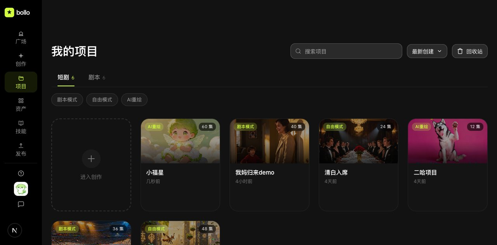

**模块说明：**

- 顶部：搜索框 + 最新/最早创建排序 + 回收站按钮
- 主 tab：短剧（6）/ 剧本（6）
- 短剧子 tab：剧本模式 / 自由模式 / AI重绘
- 网格：6 个短剧项目卡 + 1 个虚线"进入创作"卡片
- 项目卡信息：封面、模式 badge、集数、标题、更新时间

---

### 1.2 剧本项目列表

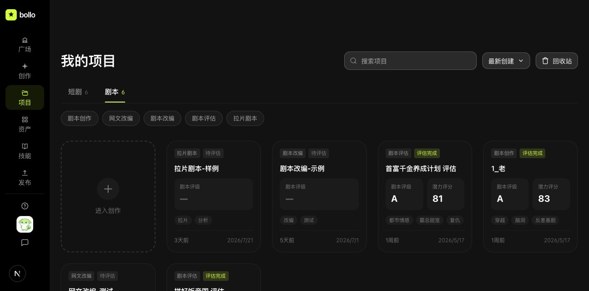

**模块说明：**

- 剧本子 tab：剧本创作 / 网文改编 / 剧本改编 / 剧本评估 / 拉片剧本
- 项目卡信息：标题、类型、状态（评估完成/待评估）、评级（A/—）、评分、标签、日期

---

### 1.3 创建项目 Modal

> 严格对齐 vibe-video `useCreateProjectDialog` 实现，4 字段单一表单

#### 1.3.1 剧本模式

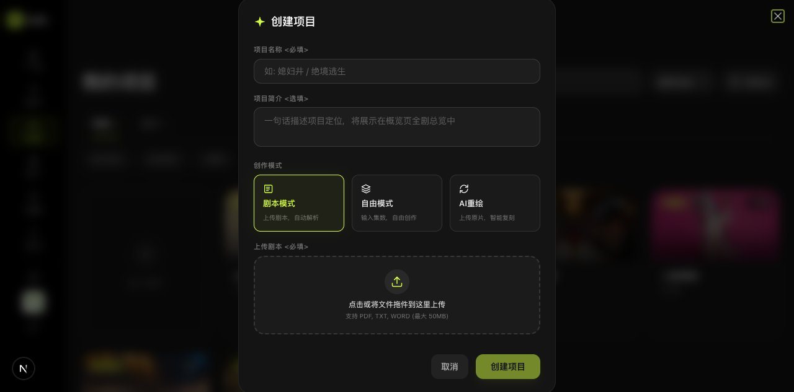

**字段：**

1. 项目名称（必填）
2. 项目简介（选填，2 行 textarea）
3. 创作模式：剧本模式（选中态）
4. 上传剧本（.txt/.pdf/.docx/.doc）

---

#### 1.3.2 AI重绘模式

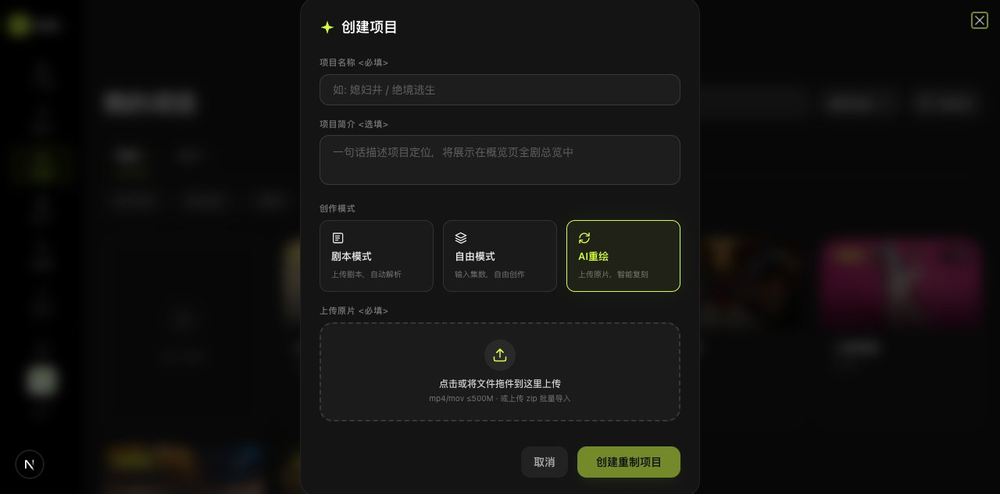

**字段：**

1. 项目名称
2. 项目简介
3. 创作模式：AI重绘（选中态）
4. 上传原片（.mp4/.mov/.zip）
5. 提交按钮文案变"创建重制项目"

---

#### 1.3.3 自由模式

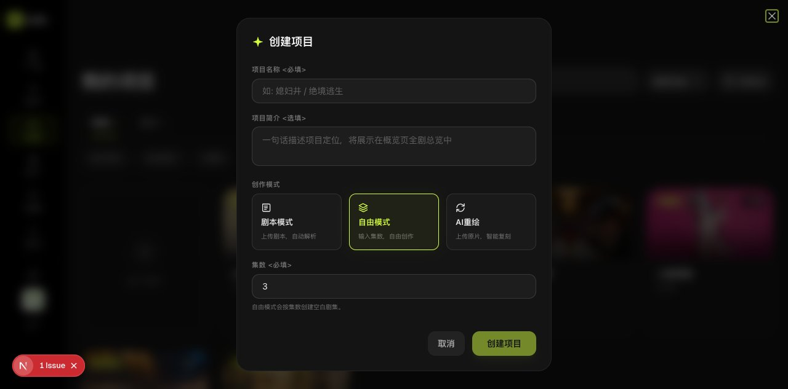

**字段：**

1. 项目名称
2. 项目简介
3. 创作模式：自由模式（选中态）
4. 集数输入（number, 1-200, 默认 3）

---

### 1.4 项目详情页

#### 1.4.1 短剧详情

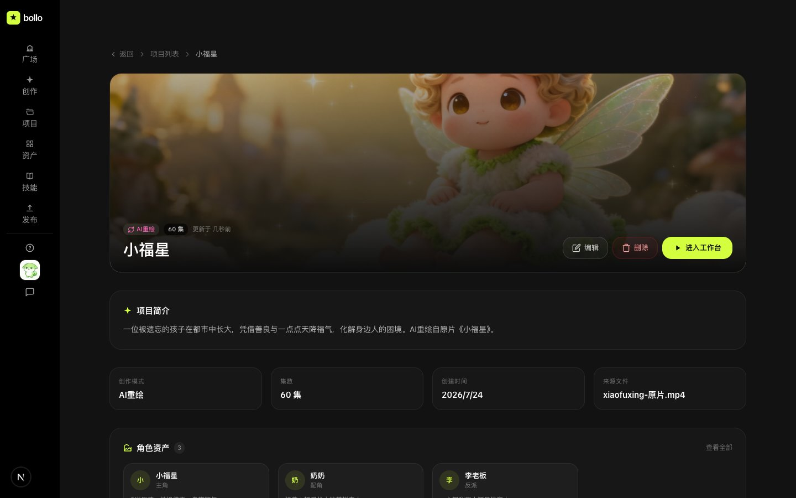

**模块说明：**

- Hero 横幅：封面图 + 模式 badge + 集数 badge + 更新时间 + 标题 + 编辑/删除/进入工作台按钮
- 项目简介卡
- 元信息卡 × 4：创作模式 / 集数 / 创建时间 / 来源文件
- 角色资产卡列表：头像 + 姓名 + 角色 + 描述

---

#### 1.4.2 剧本详情

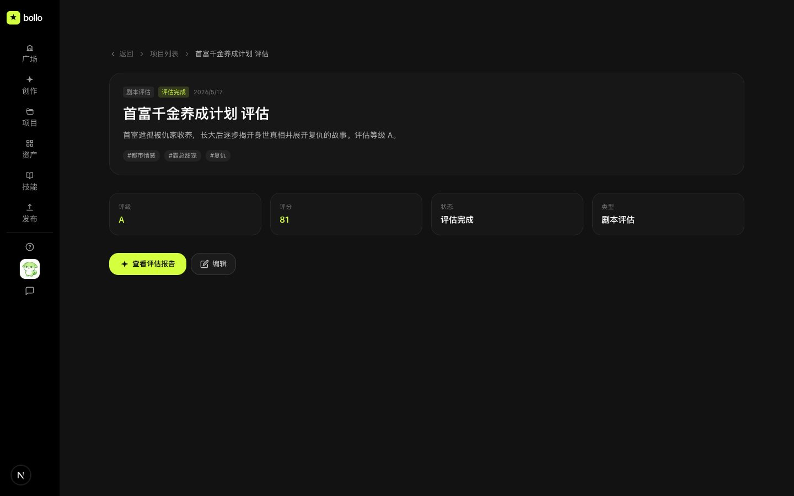

**模块说明：**

- 信息头：类型 / 状态 / 日期 / 标题 / 描述 / 标签
- 评估信息卡 × 4：评级 / 评分 / 状态 / 类型
- 操作按钮：查看评估报告 / 编辑

---

## 二、资产模块

> 资产模块包含 5 个子 tab：数字艺人 / 音色库 / 角色库 / 场景库 / 道具库

### 2.1 数字艺人

**模块说明：**

- 数量：12 个艺人
- 分类筛选：全部 / 真人演员 / 男性 / 女性 / 爆款领衔 / 实力主演 / 专业演员 / 新锐演员
- 艺人卡：封面 + 姓名 + 适合角色 + 价格 + 标签 + 试戏/收藏操作
- 创建入口：创建艺人按钮

---

### 2.2 音色库

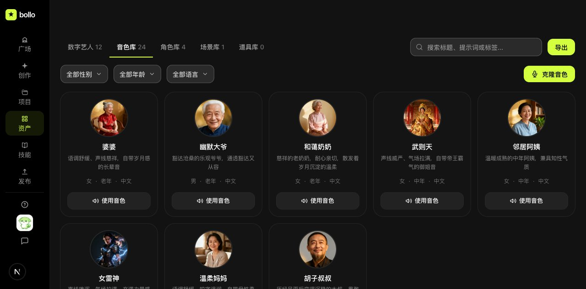

**模块说明：**

- 数量：24 个音色
- 音色卡：封面 + 名称 + 描述 + 性别 / 年龄 / 语言 + 试听操作
- 创建入口：克隆音色按钮

---

### 2.3 角色库

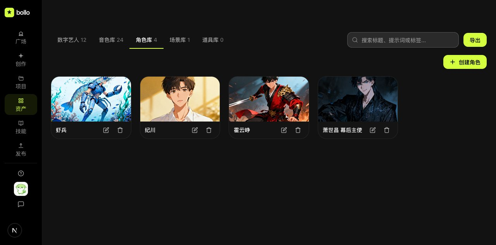

**模块说明：**

- 数量：4 个角色
- 角色卡：头像 + 姓名 + 角色 + 描述
- 创建入口：创建角色按钮

---

### 2.4 场景库

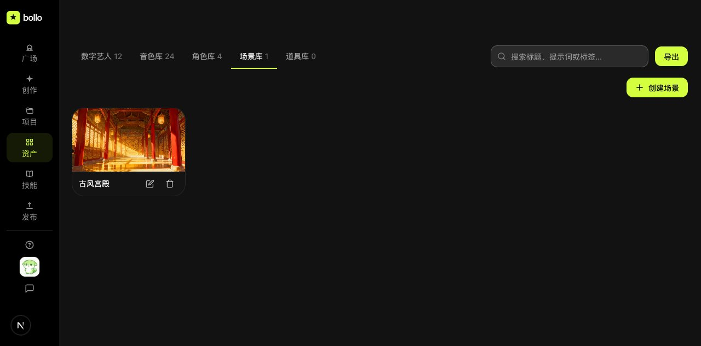

**模块说明：**

- 数量：1 个场景
- 场景卡：封面 + 名称 + 描述
- 创建入口：创建场景按钮

---

### 2.5 道具库

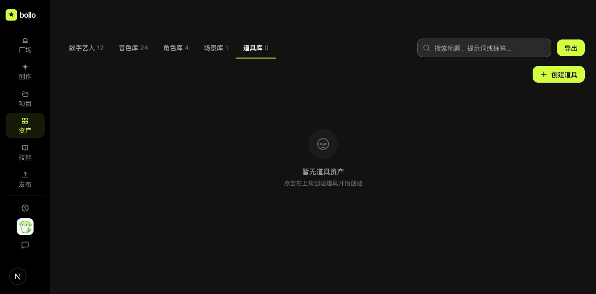

**模块说明：**

- 数量：0 个道具
- 空状态提示 + 创建道具入口

---

### 2.6 创建艺人弹窗

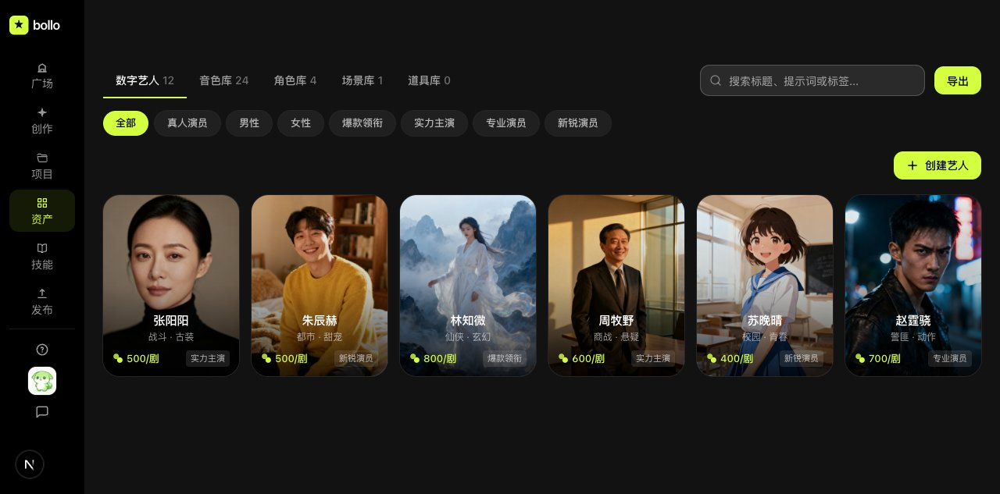

**模块说明：**

- 弹窗表单：姓名 / 性别 / 分类 / 标签 / 形象描述 / 妆容风格 / 剧本主题等
- 底部：取消 / 确认创建按钮

---

## 三、技术元信息

### 截图清单

| 序号 | 文件名 | 大小 | 内容 |
|---|---|---|---|
| 01 | 01-comic-short-list.jpg | 66 KB | 短剧项目列表 |
| 02 | 02-comic-script-list.jpg | 54 KB | 剧本项目列表 |
| 03 | 03-create-modal-script-mode.jpg | 38 KB | 创建项目Modal - 剧本模式 |
| 04 | 04-create-modal-ai-mode.jpg | 39 KB | 创建项目Modal - AI重绘 |
| 05 | 05-create-modal-free-mode.jpg | 37 KB | 创建项目Modal - 自由模式 |
| 06 | 06-detail-short-drama.jpg | 77 KB | 短剧项目详情页 |
| 07 | 07-detail-script.jpg | 43 KB | 剧本项目详情页 |
| 08 | 08-asset-artist.jpg | 89 KB | 数字艺人列表 |
| 09 | 09-asset-voice.jpg | 77 KB | 音色库列表 |
| 10 | 10-asset-character.jpg | 66 KB | 角色库列表 |
| 11 | 11-asset-scene.jpg | 35 KB | 场景库列表 |
| 12 | 12-asset-prop.jpg | 25 KB | 道具库空状态 |
| 13 | 13-asset-create-artist.jpg | 89 KB | 创建艺人弹窗 |

### 创建流程对齐说明

短剧项目创建流程严格对齐 [vibe-video](https://github.com/rikre/vibe-video) 的 `useCreateProjectDialog` 实现：

| 维度 | 状态 |
|---|---|
| Modal 字段数（4 个 UI 字段） | 100% 一致 |
| 创作模式（3 种：剧本/自由/AI重绘） | 100% 一致 |
| 条件字段（上传/集数） | 100% 一致 |
| 文件 accept 属性 | 100% 一致 |
| 文件内容读取（txt 读取 scriptContent） | 100% 一致 |
| 提交数据结构（tag/coverType/members/coverUrl） | 100% 一致 |
| 校验逻辑 | vi 更严格（多加 name 校验） |

### 项目查看对齐说明

| 维度 | vi 实现 | vibe-video 实现 |
|---|---|---|
| 入口 | 项目卡点击跳转 `/comic/[id]` | 项目卡点击进入 ProjectDetail |
| 详情页定位 | C 端展示页（Hero+简介+元信息+角色） | B 端工作台（6 子 tab：概览/剧本/资产/分镜/故事板/成片） |
| 设计差异 | 保留 vi 简单展示页 + "进入工作台"入口 | 完整工作台 |

vi 是 C 端产品定位，详情页保留简单展示风格，但提供"进入工作台"入口跳转到完整创作工作台。
